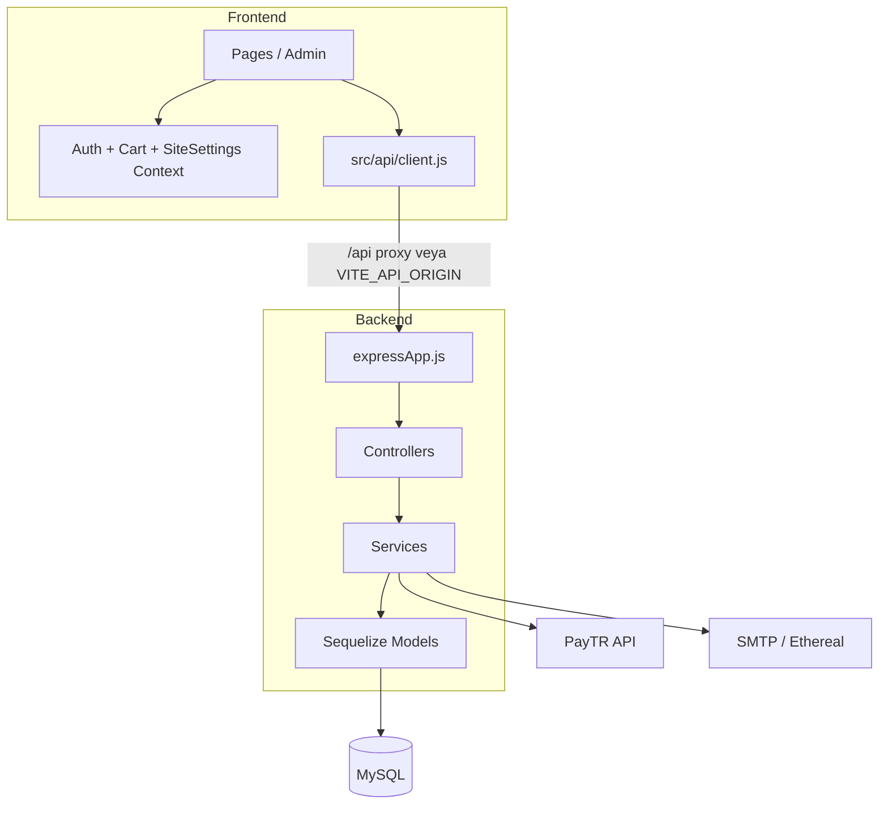

# Teknik Mimari Özeti — Site - Kopya (Asta Ticaret)

> **Tek doğruluk kaynağı (SSOT).** Yeni özellik, refactor veya hata ayıklama bu belgeye aykırı olmamalıdır.

Son güncelleme: 2026-06-02

---

## 1. Sistem bağlamı

| Öğe | Değer |
|-----|--------|
| Proje adı | `skincare-ecommerce` (Site - Kopya) |
| İş modeli | Tek kiracılı B2C cilt bakımı e-ticaret |
| Vitrin | React 18 + Vite 5 + Tailwind — port **3001** |
| API | Express 5 + Sequelize 6 + MySQL — port **5000** |
| Ödeme | PayTR iFrame + webhook |
| E-posta | Nodemailer (`backend/services/mailer.js`) |

**Ortam:** `backend/.env` hem Node hem Vite (`envDir`) için tek kaynak.

---

## 2. Katman diyagramı



---

## 3. Veritabanı şeması (özet)

| Tablo / Model | Amaç |
|---------------|------|
| `users` | Müşteri / admin, JWT, pazarlama onayları, şifre sıfırlama |
| `products` | Ürün, varyant JSON, indirim zamanlaması, soft delete |
| `orders` | Sipariş, `items` JSON, `userId`, kupon, kargo, e-fatura |
| `coupons` | İndirim kodları |
| `categories` | Mağaza kategorileri (slug, sıra) |
| `site_settings` | Key-value mağaza ayarları |
| `warehouses` + `product_warehouse_stocks` | Çoklu depo |
| `product_reviews` | Onaylı yorumlar |
| `product_stock_alerts` | Stok bildirimi |
| `campaigns` | E-posta kampanyaları |
| `newsletter_subscribers` | Bülten double opt-in |
| `email_logs` | Tüm mail denemeleri |
| `email_delivery_feedback` | Webhook bounce/complaint |
| `consent_events` | KVKK / onay kayıtları |
| `admin_audit_logs` | Admin işlem günlüğü |
| `home_hero_slides` | Ana sayfa hero |

**Şema evrimi:** `sequelize.sync` + `ensure*Column(s)` startup script’leri. `backend/migrations` boş olabilir — prod’da `DB_SYNC_ALTER` dikkatli kullanılmalı.

**Sipariş durumları:** `odeme_bekleniyor` → `hazirlaniyor` → `kargolandi` → `teslim-edildi` | `iptal-edildi`

---

## 4. API uç noktaları (tam liste)

### Sağlık

| Method | Path | Auth | Açıklama |
|--------|------|------|----------|
| GET | `/api/health` | — | Liveness (DB yok) |
| GET | `/api/health/live` | — | Aynı |
| GET | `/api/health/ready` | — | DB `authenticate` |
| GET | `/api/health/detailed` | admin | DB + SMTP + URL + PayTR özeti |
| POST | `/api/health/mail/ping` | admin | SMTP verify (mail göndermez) |
| POST | `/api/health/mail/test` | admin | Test maili gönderir |
| GET | `/api/health/mail/recipients` | admin | Admin bildirim alıcıları |

### Kimlik

| Method | Path | Auth |
|--------|------|------|
| POST | `/api/auth/register` | — |
| POST | `/api/auth/login` | — |
| POST | `/api/auth/forgot-password` | — |
| POST | `/api/auth/reset-password` | — |
| GET | `/api/auth/me` | user |
| PATCH | `/api/auth/me` | user |

### Ürünler

| Method | Path | Auth |
|--------|------|------|
| GET | `/api/products` | — |
| GET | `/api/products/slug/:slug` | — |
| GET | `/api/products/id/:id` | — |
| GET | `/api/products/:id` | — |
| GET | `/api/products/:id/reviews` | — |
| POST | `/api/products/:id/reviews` | optional |
| POST | `/api/products/:id/stock-alert` | — |
| POST | `/api/products/generate-seo` | admin |
| GET | `/api/products/all-admin` | admin |
| POST/PUT/DELETE | `/api/products/...` | admin |

### Sipariş & ödeme

| Method | Path | Auth | Not |
|--------|------|------|-----|
| POST | `/api/orders` | optional | **410 Gone** — eski akış |
| GET | `/api/orders/me` | user | |
| GET/PUT/POST | `/api/orders/*` | admin | |
| POST | `/api/payments/create-payment` | optional | PayTR token |
| POST | `/api/payments/paytr-notification` | — | PayTR webhook |

### Diğer modüller

- `/api/coupons` — validate (public), CRUD (admin)
- `/api/users` — admin
- `/api/categories` — public list, admin CRUD
- `/api/settings` — public GET, admin PUT + logo
- `/api/newsletter` — subscribe, confirm, unsubscribe
- `/api/campaigns` — admin kampanya
- `/api/home-hero` — public + admin
- `/api/inventory` — depo / stok (admin)
- `/api/legal` — sürümler, içerik, admin bundle
- `/api/consent/events` — onay kaydı
- `/api/audit-logs` — admin
- `/api/email-metrics/summary` — admin
- `/api/admin/product-reviews` — admin
- `/api/webhooks/mail-feedback` — SMTP sağlayıcı webhook
- `GET /sitemap.xml`
- `GET /uploads/*` — statik

---

## 5. Frontend state

| Context | Depolama | API |
|---------|----------|-----|
| `AuthContext` | `asta_token` / `asta_token_sess` | `/api/auth/*` |
| `CartContext` | `localStorage` `asta-cart-v2` | Checkout’ta sunucu doğrulama |
| `SiteSettingsContext` | Shell boot `GET /api/settings` | |

**Kanonik HTTP istemcisi:** `src/api/client.js` (`apiFetch`).  
**Kullanılmayan:** `src/utils/apiClient.js` (eski `token` anahtarı).

---

## 6. Mailer entegrasyonu (SSOT)

### Merkezi servis

`backend/services/mailer.js`

- `SMTP_HOST` varsa → gerçek SMTP
- Yoksa → **Ethereal** test kutusu (console’da preview URL)
- `sendMail()` hataları **fırlatmaz**; `{ success, error?, previewUrl? }` döner
- Her deneme `email_logs` tablosuna yazılır (tablo yoksa sessiz `console.warn`)

### Tetikleyiciler

| Olay | Dosya | await? | type |
|------|-------|--------|------|
| Kayıt hoş geldin | `authController` | IIFE async | `welcome` |
| Şifre sıfırlama | `authController` | IIFE async | `passwordReset` |
| Bülten onay | `newsletterController` | **Hayır** (fire-and-forget) | `newsletterConfirm` |
| PayTR başarılı ödeme | `paytrCheckoutPaymentController` | await | `orderConfirmation`, `adminNewOrder` |
| Sipariş kargolandı | `orderController.shipOrder` | **Hayır** | `orderStatusUpdate` |
| Sipariş durum güncelle | `orderController.updateOrderStatus` | **Hayır** | `orderStatusUpdate` |
| Kampanya gönderimi | `campaignController` | await (batch) | `campaign` |
| Otomatik hatırlatma | `automatedReminders` | await | `campaign` / özel |
| Stok geldi | `productStockAlerts` | await | `stockAlert` |
| Yorum onaylandı | `adminProductReviewController` | await | `productReviewApproved` |
| Sağlık testi | `healthController.mailTest` | await | `healthCheck` |

### Sessiz kalma nedenleri

1. **SMTP yok** → Ethereal; prod’da gerçek mail gitmez, sadece log/preview.
2. **Alıcı yok** → `no-recipient`, `no-admin-recipients`, `no-email` — `console.warn` + EmailLog `failed`.
3. **Fire-and-forget** → API 200 döner; mail hatası yalnızca log/EmailLog’da.
4. **Yanıltıcı API mesajı** → `shipOrder` “e-posta gönderildi” der; `sendOrderStatusUpdateEmail` await edilmez.
5. **Frontend unsubscribe URL** → `buildUnsubscribeUrl` `/abonelikten-cik/...` — vitrin route’u eksik olabilir.
6. **SMTP_PASS `#` kesilmesi** → dotenv uyarısı; `scripts/smtp-ping.js` ile doğrulanır.

### CLI araçları

```bash
node backend/scripts/smtp-ping.js          # SMTP verify
node backend/scripts/test-order-email.js   # Şablon test maili
```

### HTTP sağlık (yeni)

```bash
# Admin JWT ile
curl -X POST http://localhost:5000/api/health/mail/ping -H "Authorization: Bearer TOKEN"
curl -X POST http://localhost:5000/api/health/mail/test -H "Authorization: Bearer TOKEN" \
  -H "Content-Type: application/json" -d '{"to":"admin@ornek.com"}'
```

---

## 7. Ödeme akışı (kanonik)

1. `POST /api/payments/create-payment` → `checkoutOrderService` → `odeme_bekleniyor` + stok rezervasyonu
2. PayTR iFrame token
3. `POST /api/payments/paytr-notification` → başarı: `hazirlaniyor` + stok commit + sipariş mailleri
4. Pending timeout cron → `iptal-edildi` + envanter serbest

**Eski:** `POST /api/orders` → 410.

---

## 8. Güvenlik özeti

- JWT `protect` / `restrictTo('admin')` / `optionalProtect`
- Checkout fiyatı: `orderPricing` sunucuda
- Rate limit: login, register, kampanya, mail test, vb.
- Production: `requireProductionEnv.js` JWT / SMTP / PayTR uyarıları

---

## 9. Bilinen teknik borç

| Konu | Durum |
|------|--------|
| `src/utils/apiClient.js` | Ölü kod |
| `AdminSettingsPage.jsx` | Route yok |
| `Product.category` string vs `categories` tablosu | Çift model |
| `POST /api/orders` | 410 korunuyor |
| Migration vs `ensure*` | Runtime patch |
| B2B / multi-tenant | Sadece roadmap (`docs/MULTI_TENANT_B2B_ROADMAP.md`) |

---

## 10. Test altyapısı

- **CI:** `node --test` + Supertest (`backend/tests/api-smoke.test.js`) — DB gerektirmez
- **E2E plan:** `docs/E2E_TEST_PLANI.md`
- **Jest:** Projede yok; Node test runner tercih edilir
